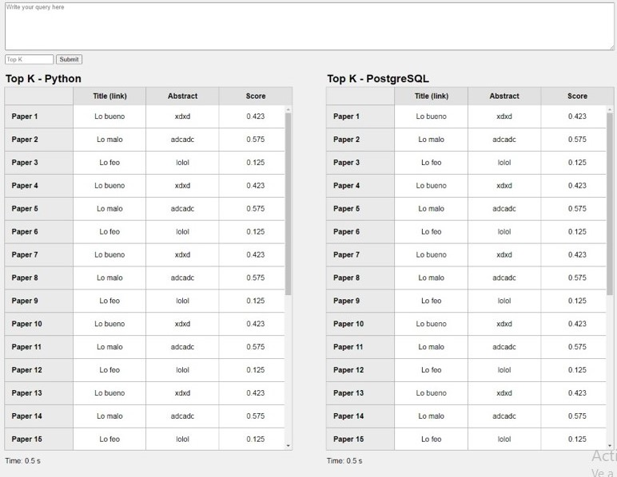

# db2-proyecto2


# Proyecto 2 del curso de Base de Datos II


## **Integrantes**
* Angeles Barazorda, JeanPier
* Aguilar, Anthony
* Chahua, Luis
* Rubio, Ignacio


## **Tabla de contenido**
* [Introducción](#introducción)
* [Técnicas a usar en el proyecto](#técnicas-a-usar)
  * [Inverted Index](#índice-invertido)
* [Implementación](#implementación)
    * [Información](#información)
    * [Inverted Index](#data-recovery)
    * [Backend](#Backend)
    * [Frontend](#Frontend)
      * [REACT y CSS](#html-y-css)
      * [JavaScript](#javascript)
* [To run](#pruebas)
* [Tested with](#pruebas)
* [Presentaciòn](#pruebas)

# **Introducción**
La razón del proyecto es crear una clase de motor de búsqueda, el cual muestre sus resultados de documentos en base a la palabra o palabras clave ingresadas.       

Para ello, implementamos en la parte del backend un ìndice invertido, lo cual nos ayudò en la recuperaciòn de textos aplicando el modelo de recuperaciòn por ranking para consultas de texto libre. Por otro lado, en la parte del fronted, se implementò una GUI que te permite escribir tu query y submitear el top k.
# **Técnicas a usar**

## **Índice invertido**
Es un método para estructurar cierta información para que sea luego recuperada a través de un motor de búsqueda. Se compone de documentos, los cuales tienen términos a una determinada frecuencia. La información de estos documentos es procesada y organizada para devolver información de una forma óptima. La consulta a realizar es otro conjunto de términos, la cual se procesa y se genera un score en base a su similitud con los documentos organizados por el índice invertido. Finalmente, la estructura debe devolver los documentos más relevantes ordenados de acuerdo al score calculado para cada uno de ellos.

# **Implementación**
## **Información**
La data recopilada corresponde a una colección de aproximadamente ... capturados a través ....

## **InvertedIndex**
Es una clase que contiene todas las funciones necesarias para procesar los textos capturados. En ello se tiene en cuenta una funciòn query, las cuales son las consultas que se recibe para luego retornar una lista ordenada de documentos que se aproximen a la consulta


## **Backend**
Se implementa un backend con ayuda de Flask, y se implementan las funciones detalladas dentro del índice invertido para posterior a ello retornar la lista ordenada de los topk de documentos mas aproximada al query.

## **Frontend**

Dentro del frontend se hizo uso las tecnologías de React, CSS y JavaScript para facilitar la interacción del usuario al momento de realizar las búsquedas, por lo que se buscó asemejar la vista como una ventana de los motores de búsqueda actuales. En la parte superior de la vista te permite introducir la query, en la parte inferior a ello te permite introducir el top k. Después de llenar ambos campos se clickea el botón submit para mandar la información al api. Luego de mandar los datos, se muestran los topk de python por la parte izquierda y por la parte derecha te muestra los topk de postgresSQL con un time en la parte inferior de cada uno de ellos.



### **REACT y CSS**
Sirvió como estructura principal de las páginas para darles forma y hacer la ventana principal donde se ingresan la búsquedas como los resultados de la query.

## To run
```sh
mkdir ~/db data
docker-compose up
```

## Tested with

[arxiv dataset](https://www.kaggle.com/datasets/Cornell-University/arxiv)


# **Presentaciòn**
Link de la presentaciòn:

https://www.canva.com/design/DAFQplvUIWU/t_TEG3gAop4abQyoDIUwYA/edit
