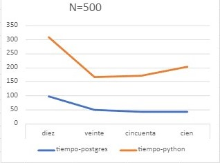

# db2-proyecto2


# Proyecto 2 del curso de Base de Datos II


## **Integrantes**
* Angeles Barazorda, JeanPier 55%
* Aguilar, Anthony 100%
* Chahua, Luis 100%
* Rubio, Ignacio 100%


## **Tabla de contenido**
* [Introducción](#introducción)
* [Técnicas a usar en el proyecto](#técnicas-a-usar)
  * [Inverted Index](#índice-invertido)
* [Implementación](#implementación)
    * [Información](#información)
    * [Inverted Index](#invertedindex)
    * [Backend](#backend)
    * [Frontend](#frontend)
* [To run](#to-run)
* [Tested with](#tested-with)
* [Presentaciòn](#presentación)

# **Introducción**
La razón del proyecto es crear una clase de motor de búsqueda, el cual muestre sus resultados de documentos en base a la palabra o palabras clave ingresadas.       

Para ello, implementamos en la parte del backend un ìndice invertido, lo cual nos ayudò en la recuperaciòn de textos aplicando el modelo de recuperaciòn por ranking para consultas de texto libre. Por otro lado, en la parte del fronted, se implementò una GUI que te permite escribir tu query y submitear el top k.

La implementacion es general sin embargo lo testeamos solo con un subset del dataset de metadata de Arxiv extrayendo los codigos y resumenes de cada paper en diferentes archivos para poder indexarlos apropiadamente.
# **Técnicas a usar**

## **Índice invertido**
Esta estructura de datos mapea palabras o terminos a un conjunto de archivos o documentos en los cuales estos terminos aparecen. Adicionalemente almacena el numero de veces que aparece en cada documento.

# **Implementación**
## **Información**
La data recopilada corresponde al dataset de Arxiv el cual fue procesado y separado en multiples archivos a indexar

## **InvertedIndex**
Es una clase que contiene la implementacion de un Índice invertido y nos permite indexar archivos o documentos e incluso carptetas o directiorios completos


## **Backend**
Se implementa un backend con ayuda de Flask, y se exponen 2 endpoints "/query" para consultar a nuestra implementacion y "/query_postgres" para consultar la implementacion de postgres

## **Frontend**

Dentro del frontend se hizo uso las tecnologías de React, CSS y JavaScript para facilitar la interacción del usuario al momento de realizar las búsquedas, por lo que se buscó asemejar la vista como una ventana de los motores de búsqueda actuales. En la parte superior de la vista te permite introducir la query, en la parte inferior a ello te permite introducir el top k. Después de llenar ambos campos se clickea el botón submit para mandar la información al api. Luego de mandar los datos, se muestran los topk de python por la parte izquierda y por la parte derecha te muestra los topk de postgresSQL con un tiempo de consulta en la parte inferior de cada uno de ellos.


## To run
```sh
mkdir ~/db data
docker-compose up
```

## Tested with

[arxiv dataset](https://www.kaggle.com/datasets/Cornell-University/arxiv)
### Test 1
  <br/>
  

### Test 2
  
  

### Test 3
  
  

## Experimentaciòn
grafica en centèsimas de segundos
 
 
 
 
 
 
# **Presentación**
Link de la presentaciòn:

https://docs.google.com/presentation/d/1K-71DAmmlQUzVuxGpff5XGNQ7EgbWbt_WpcBE6wXrms/edit?usp=sharing
